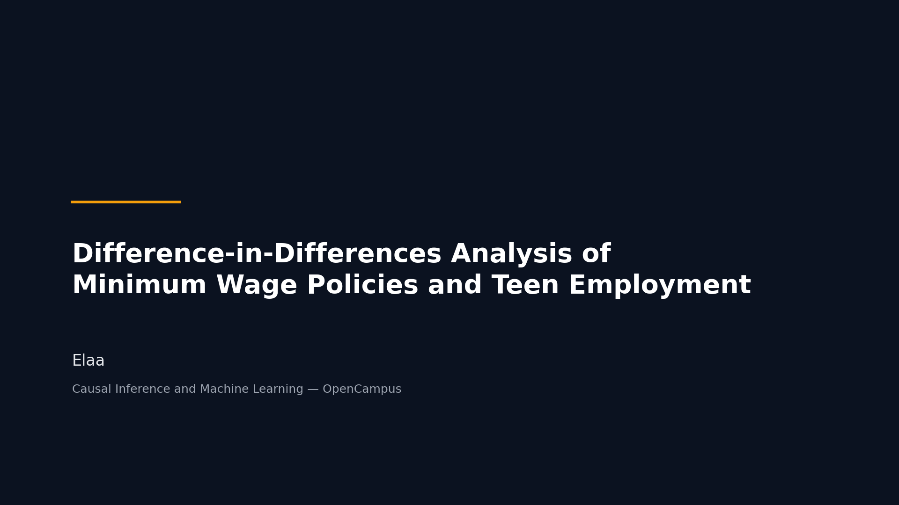

# Difference-in-Differences Analysis of Minimum Wage Policies and Teen Employment

## Repository Link
[https://github.com/Ela200/did-minimum-wage-project]

## Description
This project investigates the causal effect of minimum wage increases on county-level teen employment in the United States using Difference-in-Differences (DiD) methods.
The analysis is based on the Chapter 16 notebook from the CausalML Book and uses county-level panel data from 2001–2007.

Research Question:
Do increases in minimum wage affect teen employment?

Methods:
Difference-in-Differences
Double Machine Learning (DML-DiD)
Random Forest
Linear Regression
Causal Forest (heterogeneous treatment effects)

Dataset:
Callaway (2022)

### Task Type
Causal Inference / Treatment Effect Estimation (Difference-in-Differences with Double Machine Learning)

### Results Summary

#### Best Model Performance
- **Best Model:** Stack ensemble (linear combination of Basic, Expansion, Lasso, Ridge, and Random Forest nuisance predictions)
- **Evaluation Metric:** ATT (Average Treatment Effect on the Treated) with standard error, and cross-fitted RMSE for the outcome and treatment nuisance models
- **Final Performance:** ATT ranging from -0.049 (2005-2006) to -0.065 (2007), with the lowest or near-lowest RMSE for the outcome model across all years (e.g. RMSE dy = 0.221 in 2007)

#### Model Comparison
- **Baseline Performance:** "No Controls" (unconditional DiD) estimated ATT of -0.040 (2004) to -0.131 (2007), with RMSE dy of 0.163 to 0.230
- **Improvement Over Baseline:** Covariate-adjusted methods roughly halved the estimated effect magnitude (e.g. -0.131 to -0.065 in 2007), and modestly reduced outcome-model RMSE across all years
- **Best Alternative Model:** "Best" ensemble (picks the individual learner with lowest RMSE per nuisance function each year), performing comparably to Stack

#### Key Insights
- **Most Important Features:** Baseline county population (`lpop_0`), baseline average pay (`lavg_pay_0`), region, and baseline teen employment (`lemp_0`)
- **Model Strengths:** Estimates are consistent across multiple ML specifications (Basic, Expansion, Ridge, Random Forest, ensembles all land in a similar range), and the 2002 pre-trends placebo test found no significant effect, supporting the parallel trends assumption
- **Model Limitations:** Lasso underperforms on the treatment-model RMSE in every year, likely due to over-penalization of the polynomial interaction terms; the Causal Forest heterogeneity estimates have wide confidence intervals, so should be read as suggestive rather than conclusive; standard errors are not clustered by state or county
- **Business Impact:** The minimum wage increase is associated with a decline in teen employment that grows larger in the years following the policy change, with the effect concentrated in smaller, lower-population counties, information relevant to policymakers weighing the tradeoffs of minimum wage increases across different types of local labor markets

## Documentation
1. **[Literature Review](0_LiteratureReview/README.md)**
2. **[Dataset Characteristics](1_DatasetCharacteristics/exploratory_data_analysis.ipynb)**
3. **[Baseline Model](2_BaselineModel/baseline_model.ipynb)**
4. **[Model Definition and Evaluation](3_Model/model_definition_evaluation.ipynb)**
5. **[Presentation](4_Presentation/README.md)**

## Cover Image

